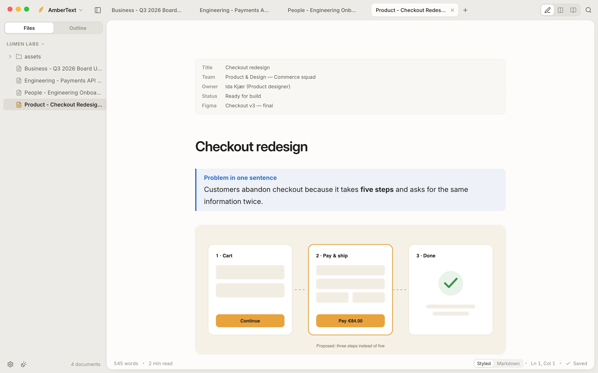
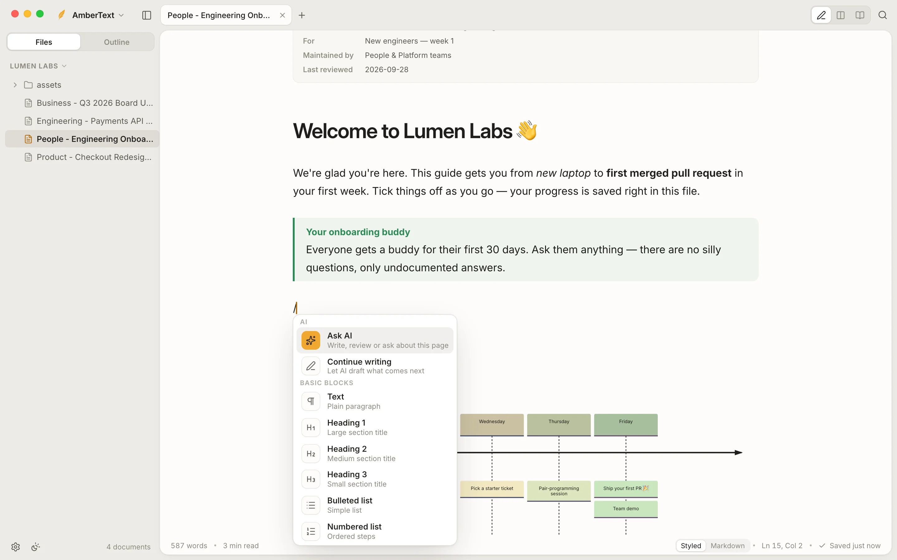
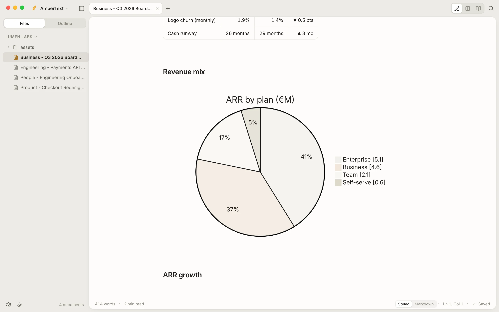
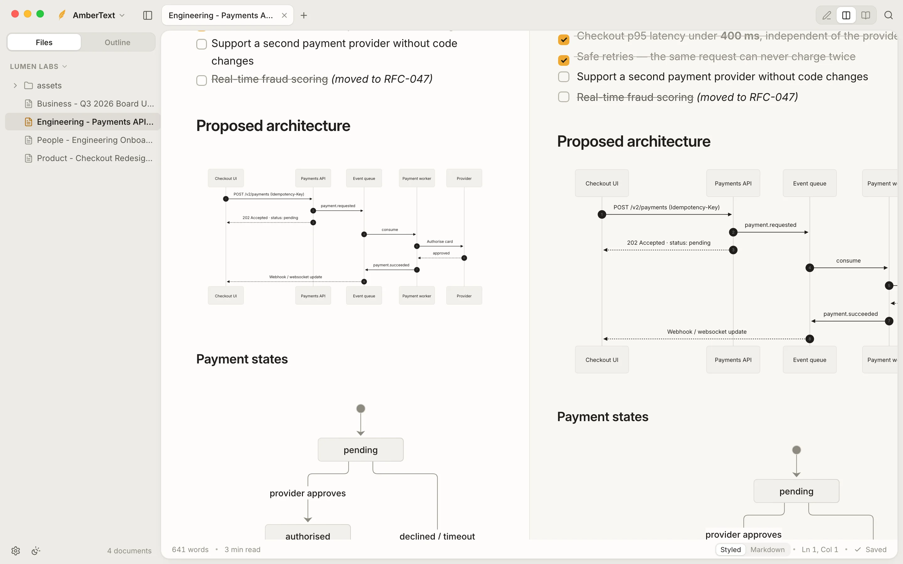
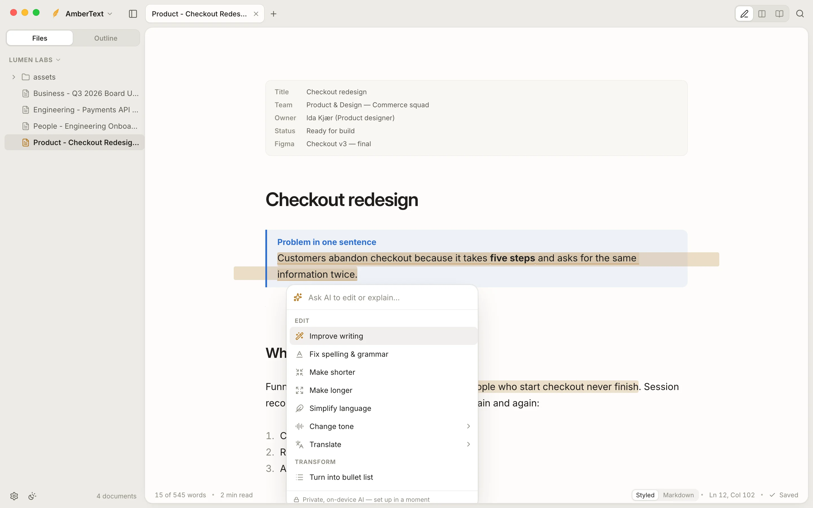
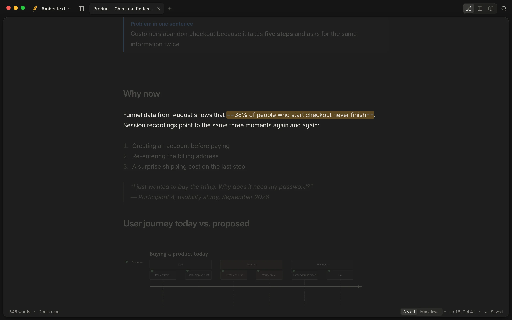
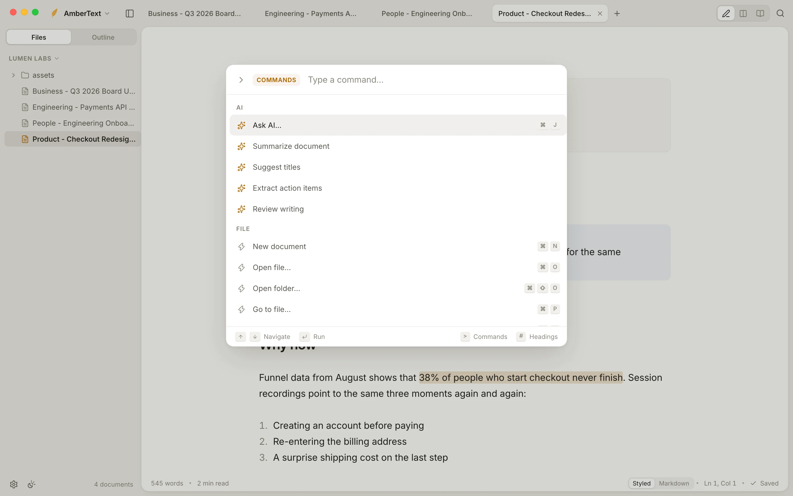
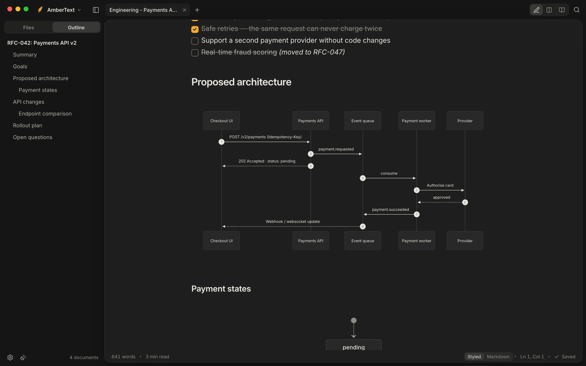
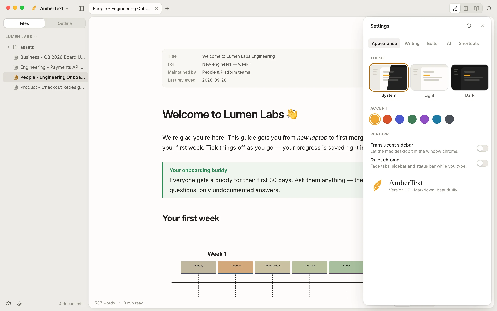
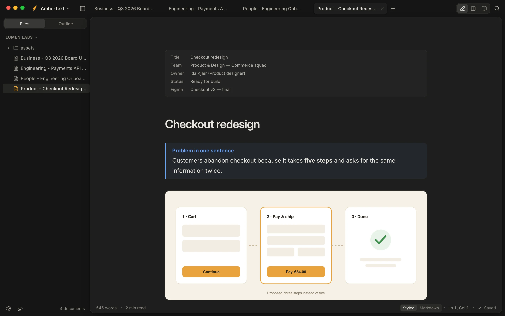

<p align="center">
  <picture>
    <!-- GitHub shows the version that matches the visitor's theme: light letters on dark, ink letters on light; the amber feather is the same in both. -->
    <source media="(prefers-color-scheme: dark)" srcset="docs/readme/ambertext-logo-dark.svg">
    <source media="(prefers-color-scheme: light)" srcset="docs/readme/ambertext-logo-light.svg">
    
  </picture>
</p>

<p align="center">
  <b>A quiet place to write.</b>
</p>

<p align="center">
  A Markdown editor for Mac and Windows. You write in clean, styled text, and every note stays a plain<br>
  Markdown file on your own computer: portable, readable anywhere, and yours.
</p>

<p align="center">
  <sub>macOS &nbsp;·&nbsp; Windows &nbsp;·&nbsp; Free and open source &nbsp;·&nbsp; No account &nbsp;·&nbsp; Works offline &nbsp;·&nbsp; Private on-device AI</sub>
</p>

<p align="center">
  <a href="https://ambertext-landing-page.vercel.app/"><b>Landing page</b></a> &nbsp;·&nbsp;
  <a href="#features">Features</a> &nbsp;·&nbsp;
  <a href="#build-it-yourself">Build it yourself</a> &nbsp;·&nbsp;
  <a href="#how-it-works">How it works</a>
</p>

<br>

<picture>
  <source media="(prefers-color-scheme: dark)" srcset="docs/readme/hero-dark.webp">
  
</picture>

```
Open a folder  →  Write in styled text  →  It saves as plain Markdown  →  Open it anywhere
```

## Features

### Styled while you write, plain text underneath

What you see is styled: headings, bold, links, tables, checkboxes. Move your cursor into any of it and the Markdown
syntax gently reappears; move away and it gets out of your way again. There is no import or export step. The file on
disk is ordinary Markdown that works in GitHub, Obsidian, VS Code or any text editor, today and in twenty years.

### Press `/` for anything



Type **/** at the start of a line to insert headings, lists, to-dos, quotes, tables, code, maths, diagrams, callouts,
links, images or today's date. Keep typing to filter. Select text and a formatting toolbar appears; paste from a web
page or Google Docs and it arrives as clean Markdown.

### Rich documents, from plain text



Everything renders right in the editor:

| | Written as | Shows as |
| --- | --- | --- |
| **Callouts** | `> [!TIP]`, `> [!WARNING]` … (GitHub's syntax) | Coloured note, tip, important, warning and caution boxes |
| **Diagrams** | ` ```mermaid ` | Flowcharts, sequence, state, Gantt, pie, timeline, journey and git diagrams |
| **Maths** | `$…$` and `$$…$$` | Typeset with KaTeX |
| **Code** | ` ```ts ` | Highlighted for over a hundred languages, with a copy button |
| **Tables** | `\| a \| b \|` | Real tables. **Tab** moves between cells and tidies the columns |
| **Properties** | `---` front matter | A tidy card at the top of the note |
| **And more** | | Footnotes, ==highlights==, task lists, images, links between headings |

### Write, Split or Read



Switch from the title bar or with **⌘1 / ⌘2 / ⌘3**. Write is the live editor, Split puts the finished page next to it
and follows your cursor, and Read is the clean page on its own.

### Writing intelligence that stays on your computer



Select a sentence and press **⌘J** to improve it, fix its spelling and grammar, make it shorter or longer, change its
tone or translate it. With nothing selected, AmberText can continue your draft, suggest titles, pull out action items
or review the whole document. You see every change before it goes into your text.

It runs on a small open model **on your own computer**: private, offline and free. Pick a size the first time:

| | Model | Good for |
| --- | --- | --- |
| **Compact** | Qwen3.5 0.8B | Quick fixes. Runs on almost anything |
| **Standard** | Qwen3.5 2B | The best balance: rewrites, tone, translation, summaries. 8 GB memory or more |
| **Enhanced** | Qwen3.5 4B | The most capable. 16 GB memory recommended |

Already run Ollama or LM Studio? Point AmberText at it instead. You can also turn AI off completely.

### Focus when you need it



**Focus mode** (⌘⇧F) softly fades everything except the paragraph you're writing. **Typewriter scrolling** keeps your
line in the middle of the screen, **Zen mode** hides everything but the page, and a **word goal** fills up in the
status bar as you go.

<table>
  <tr>
    <td width="50%" valign="top">
      
      <p><b>Everything from the keyboard.</b> ⌘K opens every command, ⌘P jumps to any file, and there is a
      heading search too.</p>
    </td>
    <td width="50%" valign="top">
      
      <p><b>Outline.</b> Every heading in the note, in the sidebar. Click one to jump there.</p>
    </td>
  </tr>
  <tr>
    <td width="50%" valign="top">
      
      <p><b>Make it yours.</b> Light, dark or match the system, seven accent colours, three typefaces (serif,
      sans, mono), and your own text size, line height and line width. Changes apply instantly.</p>
    </td>
    <td width="50%" valign="top">
      
      <p><b>Fits the system.</b> Follows light and dark mode, with a translucent sidebar on Mac and Windows.</p>
    </td>
  </tr>
</table>

### And the rest

- **Folders and tabs:** open a folder of notes, create and rename files in the sidebar, and keep several notes open as tabs.
- **Find and replace** across the note, with match case, whole words and regular expressions.
- **Export** as HTML or PDF, or copy as rich text to paste into email, Docs or Slack.
- **Images:** paste or drop them in and they're copied into an `assets` folder next to your note.
- **Saves as you go**, and notices when a file was changed by another app.

## Build it yourself

> [!NOTE]
> AmberText isn't publicly released yet, so there are no installers to download. For now you can build it from this
> repository.

You need a recent [Node.js](https://nodejs.org), [Rust](https://rustup.rs), and Tauri's
[system prerequisites](https://v2.tauri.app/start/prerequisites/) for your platform.

```bash
git clone https://github.com/Xtendr/AmberText.git
cd AmberText
npm install
```

| | Command | What you get |
| --- | --- | --- |
| **Run while developing** | `npm run app:dev` | The desktop app, reloading as you change the code |
| **Build the app** | `npm run app:build` | Mac: `AmberText.app` and a `.dmg`. Windows: an installer. Both in `src-tauri/target/release/bundle/` |
| **Browser only** | `npm run dev` | The interface at <http://localhost:1420>, with demo notes kept in memory |

## How it works

AmberText is a [Tauri 2](https://tauri.app) desktop app: a small Rust core for files and windows, with the interface in
web technology. That keeps the app small (about 10 MB) and fast to start.

- **Editor:** [CodeMirror 6](https://codemirror.net) with a live-preview layer that hides Markdown syntax away from the cursor and draws tables, diagrams, maths, images and properties as widgets.
- **Rendering:** [markdown-it](https://github.com/markdown-it/markdown-it) with footnotes, highlights, [KaTeX](https://katex.org), [Mermaid](https://mermaid.js.org) and [highlight.js](https://highlightjs.org). Output is sanitised with DOMPurify.
- **Interface:** React and zustand, with Inter, Newsreader and JetBrains Mono.
- **AI:** downloads a pinned [llama.cpp](https://github.com/ggml-org/llama.cpp) server and a Qwen3.5 model the first time you ask, checks them against known SHA-256 hashes, and runs them locally. Nothing you write is sent anywhere.

```
src/            interface (React, TypeScript)
  editor/       CodeMirror setup, live preview, slash menu, AI inline
  components/   title bar, sidebar, preview, settings, command palette
  lib/          Markdown rendering, export, file system bridge
  ai/           model list, AI actions and sessions
src-tauri/      Rust core: files, windows, the local AI runtime, app icons
docs/readme/    the images in this README
```

## License

AmberText is free software under the [GNU General Public License v3.0](LICENSE). You may use, study, share and
change it. If you share a changed version, it must be under the same licence, with its source.

The name **AmberText** and the feather logo are not covered by the licence. If you publish your own version, please
give it a different name and logo.

<br>

<p align="center">
  <sub>Made by <a href="https://github.com/Xtendr">Nicolai Brøndum Knudsen</a>.</sub>
</p>
